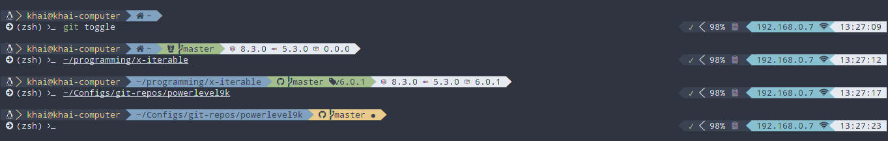

# Khải's powerlevel9k configuration

## Preview

## Requirements

* Shell: [ZSH](http://www.zsh.org/)
* ZSH Theme: [Powerline](https://github.com/powerline/powerline)
* Terminal Fonts: [Powerline Nerd Fonts](http://nerdfonts.com/)

## Installation

1. Clone this repo
2. Add `source $repo/.powerlevel9k.zsh` to your `.zshrc`

## Extra Features

### `custom_nothing`

It does literally nothing.

### `custom_package_json`

When file `package.json` is present, show node/npm/package versions/icons

#### Example

#### Environment Variables

**Enable/Disable:** Their values are `true`, `false` or in version format (`x.y.z`, e.g. `1.2.3`). If `true`, execute to get version number (might be slow in case of npm); If `false`, skip it; If matches version format, show variable's value without execution (might be useful to show npm version without waiting to execute `npm --version`)

* `POWERLEVEL9K_CUSTOM_PACKAGE_JSON_NODEVER`
* `POWERLEVEL9K_CUSTOM_PACKAGE_JSON_NPMVER`
* `POWERLEVEL9K_CUSTOM_PACKAGE_JSON_PACKAGEVER`

**Icons:** Specify icons (e.g. ``, ``, ``), set to empty (`''`) to hide them

* `POWERLEVEL9K_NODE_ICON`
* `POWERLEVEL9K_NPM_ICON`
* `POWERLEVEL9K_PACKAGE_ICON`

**Format:** How to show segment

* `POWERLEVEL9K_CUSTOM_PACKAGE_JSON_DELIMITER` is delimiter between sub-segments
* `POWERLEVEL9K_CUSTOM_PACKAGE_JSON_COMPLETE_TEMPLATE` is used for sub-segment when icon is not empty
* `POWERLEVEL9K_CUSTOM_PACKAGE_JSON_PARTIAL_TEMPLATE` is used for sub-segment when icon is empty

**Location:** How to find `package.json` location

* `POWERLEVEL9K_CUSTOM_PACKAGE_JSON_CHECK_BY_REPO`: If `true`, only consider git repos (directories that has `.git`) to be possible candidates, otherwise, accept all folders
* `POWERLEVEL9K_CUSTOM_PACKAGE_JSON_CHECK_PARENT`: If set to `inf`, check all parent candidates if current candidate (a.k.a repo/directory which is/contains current working directory) fails. If set to a number `n`, only check `n` parent candidates. If set to `0`, don't check any parent candidate.
